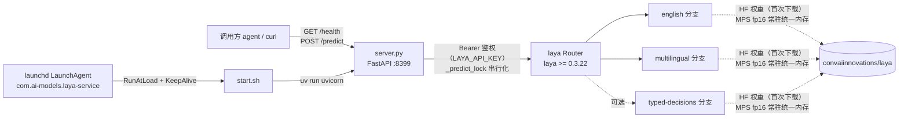

# laya-service

> Laya 判别式决策模型的本地 HTTP 服务，供其他 agent 调用。
> 单模块 Python 项目：FastAPI + Apple Silicon MPS（fp16），毫秒级判别式推理，不做文本生成。

最后更新：2026-09-30 13:44 CST（由 `/init-project` 生成）

---

## 一、项目愿景

将 [convaiinnovations/laya](https://huggingface.co/convaiinnovations/laya)（Apache-2.0，TypeSafe Jev 开源复刻）封装为本机/局域网 HTTP 服务，为其他 agent 提供**意图识别 / 路由分流 / 护栏判定**能力：输入任意 `state`（文本或结构化 JSON）与一组 `questions`，输出结构化概率与置信度。

核心特性：

- 判别式模型，单次前向毫秒级，输出概率而非生成文本
- 多分支自动分流：中文为主自动走 `multilingual`，其余走 `english`
- 权重常驻 Apple Silicon 统一内存（MPS fp16），可选 Bearer Token 鉴权
- launchd 常驻：登录自启 + 崩溃自动拉起（KeepAlive）

## 二、架构总览



请求链路：`调用方 → FastAPI（鉴权 → 503 未就绪检查 → predict_lock 串行）→ laya Router（语种分流选分支）→ 分支模型前向 → 结构化概率返回`。底层模型非线程安全，故全程单锁串行；单次前向仅几十毫秒，锁开销可忽略。

## 三、模块索引

| 模块 | 路径 | 职责 |
|---|---|---|
| laya-service（根即模块） | `./` | FastAPI 服务本体：接口、鉴权、分支加载与推理调度 |

> 本项目为**单模块结构**（`pyproject.toml` 位于根目录，唯一源码文件 `server.py`），无独立子模块目录，故不生成模块级 `CLAUDE.md`，详尽内容直接并入本文件。导航面包屑：无子模块。

## 四、关键文件

| 文件 | 说明 |
|---|---|
| `server.py` | 全部服务逻辑：环境变量解析、lifespan 分支预加载、`/health`、`/predict`、Bearer 鉴权、推理串行锁 |
| `start.sh` | 启动脚本：`uv run uvicorn server:app`，内含 `HF_HUB_DISABLE_XET=1` 与镜像注释 |
| `com.ai-models.laya-service.plist` | launchd LaunchAgent 定义（换机时拷到 `~/Library/LaunchAgents/`） |
| `pyproject.toml` | 项目元数据与依赖（fastapi / laya / uvicorn[standard]，Python ≥ 3.12） |
| `.python-version` | `3.12`（uv 据此选解释器） |
| `uv.lock` | 锁定依赖（生成物，勿手改） |

## 五、接口契约

### GET /health

```bash
curl -s http://127.0.0.1:8399/health
# {"status":"ok","device":"mps","branches":["english","multilingual"]}
```

`status` 为 `ok`（就绪）/ `loading`（分支仍在加载）。

### POST /predict

```json
{
  "state": { "...": "任意 JSON，模型判定的输入" },
  "questions": {
    "题目名": {
      "type": "choice | score | boolean",
      "instructions": "提示语",
      "criteria": { "选项": "描述" }
    }
  },
  "model": "english | multilingual | typed-decisions（可选，默认自动按语种分流）"
}
```

返回（节选）：`{ "choice": "billing", "probabilities": {...}, "confidence": 0.99 }`

约束与注意：

- `questions[].type` 支持 `choice`（单选）/ `score`（打分）/ `boolean`（**中文场景建议改双选项 choice**）
- 门控只读顶层 `confidence`，**不要读 `action.act_probability`**（恒为 1.0）
- 中文场景置信度整体偏高，自动放行阈值建议 **≥ 0.95**
- 模型未就绪返回 503；`ValueError` 映射 400
- `LAYA_API_KEY` 非空时所有 `/predict` 请求须带 `Authorization: Bearer <key>`，否则 401（`/health` 无需鉴权）

## 六、环境变量

| 变量 | 默认 | 说明 |
|---|---|---|
| `LAYA_PORT` | `8399` | 监听端口 |
| `LAYA_HOST` | `127.0.0.1` | 监听地址；供局域网访问时改 `0.0.0.0` |
| `LAYA_DEVICE` | `mps` | 推理设备（`mps` / `cpu`） |
| `LAYA_MODELS` | `english,multilingual` | 加载分支，逗号分隔，可加 `typed-decisions` |
| `LAYA_API_KEY` | 空 | 设置后 `/predict` 需 Bearer Token |
| `LAYA_MAX_LOADED` | `2` | Router 常驻内存的最大分支数 |

另在 `start.sh` 中固定 `HF_HUB_DISABLE_XET=1`；国内拉权重卡住可启用 `HF_ENDPOINT=https://hf-mirror.com`。

## 七、常用命令

```bash
# 前台启动（开发调试）
./start.sh

# launchd 常驻
launchctl bootstrap gui/$(id -u) ~/Library/LaunchAgents/com.ai-models.laya-service.plist  # 首次加载
launchctl kickstart -k gui/$(id -u)/com.ai-models.laya-service                            # 重启
launchctl bootout gui/$(id -u)/com.ai-models.laya-service                                 # 卸载
launchctl print gui/$(id -u)/com.ai-models.laya-service | rg state                        # 状态

# 日志
tail -f /tmp/laya-service.log /tmp/laya-service.err.log
```

依赖管理一律走 `uv`（`uv sync` / `uv run`），禁止 pip 直装。

## 八、全局规范与注意事项

1. **首次前向约 1.6s**（MPS 初始化预热）：服务启动后先空跑一条 `/predict` 再对外宣称就绪。
2. **推理串行化是硬约束**：`_predict_lock` 不可移除（底层模型非线程安全）。
3. **分支白名单**：`LAYA_MODELS` 中的未知分支会在启动时直接抛错，可选值仅 `english` / `multilingual` / `typed-decisions`。
4. `state` / `questions` 参与语言检测：中文为主自动路由到 multilingual 分支。
5. plist 中硬编码了本机绝对路径（`/Users/fengshuai/...`），换机部署需同步修改。
6. 端口 8399 绑定 127.0.0.1，对外开放需显式改 `LAYA_HOST=0.0.0.0` 并自行评估鉴权。

## 九、初始化覆盖率

- **已扫描**：7/7 个文本文件（100%）——`server.py`、`start.sh`、`pyproject.toml`、`README.md`、`com.ai-models.laya-service.plist`、`.gitignore`、`.python-version`
- **忽略**：`.venv/`、`__pycache__/`（生成物）、`uv.lock`（锁文件）、`.git`
- **模块识别**：1 个（根即模块），子模块 0 个
- **缺口**：无。仓库已全覆盖，无待补扫路径；未来若拆分出子模块，重跑 `/init-project` 做增量更新即可
