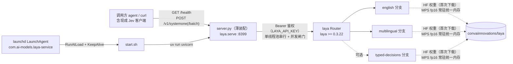

# laya-service

> Laya 判别式决策模型的本地 HTTP 服务，供其他 agent 调用。
> 单模块 Python 项目：FastAPI + Apple Silicon MPS（fp16），毫秒级判别式推理，不做文本生成。
> 暴露 **TypeSafe Jev `/v1/systemone` wire 协议**，现成 Jev 客户端改 baseUrl 即用。

最后更新：2026-09-30 19:47 CST（新增「上下文与 token 预算」：实测容量、截断行为、预算分层）

---

## 一、项目愿景

将 [convaiinnovations/laya](https://huggingface.co/convaiinnovations/laya)（Apache-2.0，TypeSafe Jev 开源复刻）封装为本机/局域网 HTTP 服务，为其他 agent 提供**意图识别 / 路由分流 / 护栏判定**能力：输入任意 `state`（文本或结构化 JSON）与一组 `questions`，输出结构化概率与置信度。

核心特性：

- 判别式模型，单次前向毫秒级，输出概率而非生成文本
- 多分支自动分流：中文为主自动走 `multilingual`，其余走 `english`
- 权重常驻 Apple Silicon 统一内存（MPS fp16），可选 Bearer Token 鉴权
- launchd 常驻：登录自启 + 崩溃自动拉起（KeepAlive）

## 二、架构总览



请求链路：`调用方 → laya.serve（鉴权 → 并发闸门 → 单线程池串行推理）→ laya Router（语种分流选分支）→ 分支模型前向 → {model, answers, usage, routing} 返回`。推理由官方实现的 ThreadPoolExecutor(1) + asyncio.Lock 串行化，另有一层并发准入信号量（满时 503 + Retry-After）。

## 三、模块索引

| 模块 | 路径 | 职责 |
|---|---|---|
| laya-service（根即模块） | `./` | 启动装配：复用 laya 包官方 `laya.serve.create_app()`，暴露 Jev `/v1/systemone` wire 协议（端点/鉴权/限流/防护全由官方代码承担） |

> 本项目为**单模块结构**（`pyproject.toml` 位于根目录，唯一源码文件 `server.py`），无独立子模块目录，故不生成模块级 `CLAUDE.md`，详尽内容直接并入本文件。导航面包屑：无子模块。

## 四、关键文件

| 文件 | 说明 |
|---|---|
| `server.py` | 薄装配层（30 行）：默认值注入（`LAYA_DEVICE`/`LAYA_MODELS`）+ `create_app()`。端点、鉴权、限流均来自 laya.serve 官方实现 |
| `start.sh` | 启动脚本：`uv run uvicorn server:app`，内含 `HF_HUB_DISABLE_XET=1` 与镜像注释 |
| `com.ai-models.laya-service.plist` | launchd LaunchAgent 定义（换机时拷到 `~/Library/LaunchAgents/`） |
| `pyproject.toml` | 项目元数据与依赖（fastapi / laya / uvicorn[standard]，Python ≥ 3.12） |
| `.python-version` | `3.12`（uv 据此选解释器） |
| `uv.lock` | 锁定依赖（生成物，勿手改） |

## 五、接口契约（TypeSafe Jev wire 协议）

端点与防护全部来自 laya 包官方 `laya.serve`（`pip install "laya[serve]"` 的同一实现，本项目直接 import，无需额外依赖）。

### GET /health

```bash
curl -s http://127.0.0.1:8399/health
# {"status":"ok","loaded":["english","multilingual"],"device":"mps",
#  "checkpoint_devices":{"english":"mps","multilingual":"mps"},...}
```

`status` 就绪后恒为 `ok`；`loaded` 为常驻分支，`checkpoint_devices` 为各分支实际计算设备。

### POST /v1/systemone（单条判定）

```json
{
  "state": { "...": "任意 JSON，模型判定的输入" },
  "questions": {
    "题目名": {
      "type": "choice | score | noul",
      "instructions": "提示语",
      "criteria": { "选项": "描述" }
    }
  },
  "model": "english | multilingual | typed-decisions（可选；未知值如 jev-1 视为不指定）",
  "max_len": 8192, "head_max_len": 512, "lang": "...", "lang_guess": "...", "min_confidence": 0.5
}
```

返回顶层 `{model, answers, usage, routing}`，另带 `Server-Timing: inference;dur=...` 头：

- `answers.<题目>`：`{type, choice|score|noul, probabilities, confidence, answer_confidence, action, ...}`
- `usage`：`{input_tokens, output_tokens, state_tokens, truncated, ...}`
- `routing`：`{model, repo, reason, detection}`——实际分支与语种判定依据

约束与注意：

- `questions[].type`：`choice`（单选，criteria 为字典）/ `score`（打分，criteria 为级别描述列表，缺描述 422）/ `noul`（布尔；中文场景建议改双选项 choice）
- **门控读 `answer_confidence`**（所报答案的校准概率，各题型统一）；`confidence` 是 1−归一化熵，与 Jev 的公式不同，Jev 阈值不能直接搬；不要读 `action.act_probability`（恒为 1.0）
- 中文场景置信度整体偏高，自动放行阈值建议 **≥ 0.95**，最好按自己的数据重校
- 错误码：400 body 缺 `questions`｜401 鉴权失败｜413 单题选项 >100｜422 题目畸形/超预算｜500 推理内部错误（详情只进日志）｜**503 忙**（并发满，带 `Retry-After: 1`）
- 限制：`state` ≤ 50000 字符、≤ 64 题、body ≤ 2MB

### POST /v1/systemone/batch（批量）

`{states: [...≤64], questions, model?}` → `{results: [...], total_usage: {input_tokens, ...}}`。

### 上下文与 token 预算（源码+实测验证）

`state` 支持文本 / JSON 对象 / **对话轮次列表**三种形态；服务端**无状态、无会话概念**，多轮上下文完全由调用方每次重传，服务不保存历史。

- **无条数/每条限制**：列表被 `json.dumps` 压平成单个字符串整体判定，仅校验 `state` ≤ 50000 字符（`serve.py: MAX_STATE_CHARS`）；不存在轮数/每轮 token 校验
- **无角色概念**：tokenizer 特殊 token 仅 `[CLS]/[SEP]/[MASK]/[PAD]/[UNK]`；`role`/`content` 只是微调学到的普通 JSON 字段（`common.py: serialize_state` 无模板）
- **序列格式**：`[CLS] 题干 [SEP] [MASK]选项… [SEP] state [SEP]` —— **state 在最末尾**，题干+选项（`head_max_len`）优先占预算
- **截断按形态分流**：list → 左截断保留最新（`agent.py: truncate_left = isinstance(state, list)`）；str/dict → 右截断保留开头
- **截断是 token 粒度，轮次边界不参与**：一条消息可被从中间切开（实测 10 轮超预算时第 6 轮被切中段）——轮次裁剪/摘要压缩由调用方负责
- **usage 可观测**：`state_tokens`（全量）/ `state_tokens_dropped` / `truncated` / `truncated_questions`；实际用量 = `state_tokens − state_tokens_dropped`

预算分层（源码验证）：

| 层级 | 值 | 出处 |
|---|---|---|
| 模型硬上限 | 8192 | ModernBERT/mmBERT `max_position_embeddings` |
| 服务准入 | 8192 | `LAYA_MAX_TOKEN_BUDGET`（超出 422） |
| 分支默认 `max_len` | 512 / 1024 / 1024 | 各分支 `rl_agent_config.json`（english / multilingual / typed-decisions） |
| 分支 `head_max_len` | 192 / 256 / 256 | 同上 |
| state 实际可用 | ≈ `max_len − head_max_len − 1` | `common.py: build_sequence` 的 `room` |

实测容量（multilingual 默认 ≈ 991 token）：20 轮短对话（571 token）不截断；40 轮（1151 token）丢 160。中文默认走 multilingual，**需要更长上下文必须显式传 `max_len`**（≤ 8192）。

> laya 包的 `predict_long`（超长 state 滑窗扫描+聚合）**未暴露到 HTTP**；长 state 超出 `max_len` 的部分被直接丢弃。

## 六、环境变量

| 变量 | 默认 | 说明 |
|---|---|---|
| `LAYA_PORT` / `LAYA_HOST` | `8399` / `127.0.0.1` | 由 start.sh 传给 uvicorn（laya.serve 的同名变量不生效，因为不用它的 main()） |
| `LAYA_DEVICE` | `mps` | 推理设备（`mps` / `cpu`） |
| `LAYA_MODELS` | `english,multilingual` | 预加载分支，逗号分隔，可加 `typed-decisions` |
| `LAYA_API_KEY` | 空 | 设置后判定接口需 Bearer Token（`/health` 免鉴权） |
| `LAYA_MAX_LOADED` | 未设 → Router 默认 2 | 常驻分支上限；预加载的分支不受它驱逐 |
| `LAYA_PRELOAD` | `1` | 启动即预加载；置 0 则首次请求才加载（端口开得更早） |
| `LAYA_MAX_CONCURRENT` | 16 | 并发准入上限（满时 503 + Retry-After） |
| `LAYA_MAX_TOKEN_BUDGET` | 8192 | 请求可传的 max_len/head_max_len 上限 |

另在 `start.sh` 中固定 `HF_HUB_DISABLE_XET=1`；国内拉权重卡住可启用 `HF_ENDPOINT=https://hf-mirror.com`。

## 七、常用命令

```bash
# 前台启动（开发调试）
./start.sh

# launchd 常驻
launchctl bootstrap gui/$(id -u) ~/Library/LaunchAgents/com.ai-models.laya-service.plist  # 首次加载
launchctl kickstart -k gui/$(id -u)/com.ai-models.laya-service                            # 重启
launchctl bootout gui/$(id -u)/com.ai-models.laya-service                                 # 卸载
launchctl print gui/$(id -u)/com.ai-models.laya-service | rg state                        # 状态

# 日志
tail -f /tmp/laya-service.log /tmp/laya-service.err.log
```

依赖管理一律走 `uv`（`uv sync` / `uv run`），禁止 pip 直装。

## 八、全局规范与注意事项

1. **首次前向约 1.6s**（MPS 初始化预热）：服务就绪后先空跑一条 `/v1/systemone` 再对外宣称就绪。权重在 import 期预加载，端口就绪后才监听。
2. **协议即 Jev**：`/v1/systemone`（单条）+ `/v1/systemone/batch`（批量）。v0.1 的自定义 `/predict` 已移除；如需临时兼容可在 server.py 里给 `app` 追加路由。
3. **推理串行化由官方实现承担**：ThreadPoolExecutor(1) + asyncio.Lock，勿在装配层再叠加锁。
4. `state` / `questions` 参与语言检测：中文为主自动路由到 multilingual 分支。
5. plist 中硬编码了本机绝对路径（`/Users/fengshuai/...`），换机部署需同步修改。
6. 端口 8399 绑定 127.0.0.1，对外开放需显式改 `LAYA_HOST=0.0.0.0` 并自行评估鉴权。
7. `LAYA_PORT`/`LAYA_HOST` 由 start.sh 传给 uvicorn；`LAYA_ROOT_PATH`/`LAYA_LOG_LEVEL` 等 laya.serve 其余变量仅在用其 `main()` 启动时生效。

## 九、初始化覆盖率

- **已扫描**：7/7 个文本文件（100%）——`server.py`、`start.sh`、`pyproject.toml`、`README.md`、`com.ai-models.laya-service.plist`、`.gitignore`、`.python-version`（2026-09-30 14:06 复核，含协议切换）
- **忽略**：`.venv/`、`__pycache__/`（生成物）、`uv.lock`（锁文件）、`.git`
- **模块识别**：1 个（根即模块），子模块 0 个
- **缺口**：无。仓库已全覆盖，无待补扫路径；未来若拆分出子模块，重跑 `/init-project` 做增量更新即可
